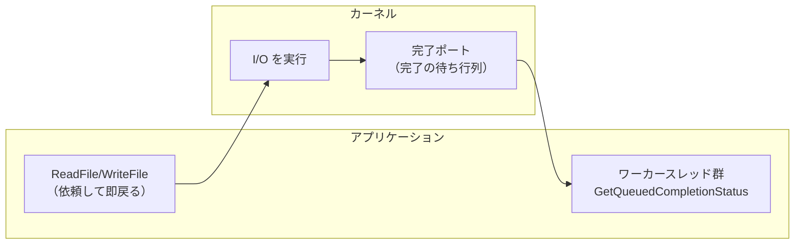
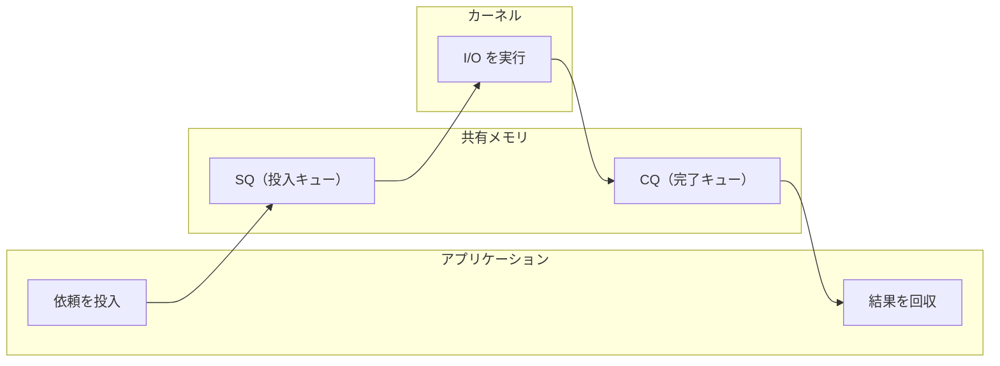

# 非同期 I/O と io_uring

前章の `epoll` は「fd が読み書きできる状態になったか」を効率よく教えてくれる仕組みでした。しかし、教えてもらった後の `read`/`write` 自体は、相変わらずアプリケーションが行います。本章ではさらに一歩進み、**読み書きそのものをカーネルに丸ごと任せる** という発想――**非同期 I/O（asynchronous I/O）**――を学びます。そして、その現代的な決定版である Linux の **io_uring** までたどり着きます。本書のクライマックスです。

## 同期と非同期、ブロッキングと非ブロッキング

ここで用語を整理しておきます。混同しやすい二つの軸があります。

- **ブロッキング / ノンブロッキング** — 操作の完了を「待つか／待たずに即戻るか」。前章の主題。
- **同期 / 非同期** — 操作を「自分で行うか／誰か（カーネル）に任せて後で結果を受け取るか」。本章の主題。

前章の `epoll` + ノンブロッキング `read` は、「待たない」点ではノンブロッキングですが、`read` という読み取り作業は **自分で同期的に行う** ので、分類上は **同期ノンブロッキング** です。これに対し本章の非同期 I/O は、**「読んでおいて」とカーネルに依頼だけして自分は別の仕事に移り、完了したら通知を受け取る** 方式です。レストランにたとえると、同期は「料理ができるまで自分でカウンターで待つ」、非同期は「番号札をもらって席に戻り、できたら呼んでもらう」に近いと言えます。

## 古い非同期 I/O：POSIX AIO とその限界

非同期 I/O の発想自体は新しくありません。UNIX 系には古くから **POSIX AIO**（`aio_read`/`aio_write` など）という標準の非同期 I/O インタフェースがあります。「読み込みを依頼し、完了したらシグナルやコールバックで知らせてもらう」という、まさに非同期のかたちです。

しかし POSIX AIO は広くは使われませんでした。Linux における実装上の制約が大きく、たとえば通常のバッファ付きファイル I/O とうまく噛み合わない、内部的にスレッドプールで模擬しているだけで真の非同期になっていない実装がある、といった問題を抱えていたためです。結果として、多くの高性能サーバは前章の `epoll` を中心に据え、ファイルの非同期 I/O は諦めるか別の工夫でしのぐ、という状態が長く続きました。この経緯は [Linux System Programming](#cite:love2013) や [The Linux Programming Interface](#cite:kerrisk2010) の関連章に整理されています。

> [!NOTE]
> 実は `epoll` には大きな弱点があります。**通常のファイル（ディスク上のファイル）に対しては無力** だということです。`epoll` は「ソケットやパイプが読めるか」を監視できますが、ローカルファイルは「常に読める」とみなされ、実際のディスク読み取りでは結局ブロックしてしまいます。ディスク I/O も含めて非同期化したい、という長年の願いに応えたのが io_uring です。

## Windows の答え：IOCP

非同期 I/O について、Windows は早くから完成度の高い答えを持っていました。**IOCP（I/O Completion Ports）** です。IOCP は「I/O を依頼し、完了したものを完了ポート経由でまとめて受け取る」という、典型的な **完了通知型（completion-based）** の非同期 I/O です。

ここで前章との対比が効いてきます。`epoll` は「準備ができた（これから読める）」を知らせる **準備完了通知型（readiness-based）** でしたが、IOCP は「読み書きが終わった」を知らせる **完了通知型** です。

| | 通知の意味 | 代表 |
|---|----------|------|
| 準備完了通知型 | これから読み書きできる | `select`/`poll`/`epoll`（Linux）, `kqueue`（BSD） |
| 完了通知型 | 読み書きがもう終わった | IOCP（Windows）, io_uring（Linux） |

### IOCP はどう動くのか

性質だけでなく、仕組みももう少し具体的に見てみましょう。その詳細は Microsoft の公式ドキュメント[#cite:msiocp]にまとめられています。中心にあるのは **完了ポート（completion port）** と呼ばれる、カーネルが管理する 1 本の待ち行列（キュー）です。プログラマはおおむね次の手順で使います。

1. 完了ポートを 1 つ作り、非同期に扱いたいファイルやソケットをそれに **関連付ける**。
2. `ReadFile` / `WriteFile` などを **オーバーラップド I/O（overlapped I/O）** モードで呼ぶ。これは「読み書きを依頼するだけ」で、その場では完了を待たずにすぐ戻る。実際の読み書きはカーネルがバックグラウンドで進める。
3. あらかじめ用意しておいた **ワーカースレッドの一群** が `GetQueuedCompletionStatus` を呼び、完了ポートから「終わった I/O」を 1 つ取り出す。まだ何も終わっていなければ、そのスレッドはそこで眠って（ブロックして）待つ。
4. I/O が 1 つ完了するたびカーネルが完了ポートに通知を積む。すると眠っていたワーカースレッドの 1 つが起こされ、結果を受け取って後続処理を行い、また次の完了を取りに戻る。

IOCP の巧妙な点は、**カーネルが「同時に走らせるワーカースレッドの数」を CPU コア数程度に自動で絞る** ことです。完了が一気に殺到しても、起こされるスレッド数は抑えられるため、スレッドが増えすぎてコンテキストスイッチばかりに時間を取られる――という事態を避けられます。少数のスレッドで大量の接続をさばく、すなわち C10K 問題[#cite:kegel2006]への Windows なりの回答が、早くからここにあったわけです。

> [!NOTE]
> 完了ポートに完了が積まれていく様子は、本章の後半で出てくる io_uring の **CQ（完了キュー）** とよく似ています。「依頼を投げ、完了をキューから回収する」という完了通知型の骨格は、両者に共通しています。

長らく Linux 側には IOCP に対抗できる完了通知型の本命がありませんでした。その空白を、ついに埋めたのが io_uring です。

## io_uring：二つのリングという発想

**io_uring** は、2019 年に Linux 5.1 で導入された、Jens Axboe による新しい非同期 I/O インタフェースです。設計の狙いは、これまでの方式の弱点――システムコールの呼び出し回数の多さ、データのコピーコスト、ファイル I/O を非同期化できないこと――を一挙に解決することでした。その設計思想は、作者自身による解説 [Efficient IO with io_uring](#cite:axboe2019) にまとめられています。

io_uring の核心は、名前のとおり **二つのリングバッファ（ring buffer、環状の待ち行列）** です。これらは、**アプリケーションとカーネルが共有するメモリ** 上に置かれます。

- **SQ（Submission Queue、投入キュー）** — アプリケーションが「これをやって」という依頼（SQE: Submission Queue Entry）を書き込むリング。
- **CQ（Completion Queue、完了キュー）** — カーネルが「これが終わったよ」という結果（CQE: Completion Queue Entry）を書き込むリング。

仕組みはこうです。アプリケーションは「ファイル A から 4KB 読んで」「ソケット B へこのデータを送って」といった依頼を SQ にどんどん積みます。カーネルはそれを取り出して非同期に実行し、終わったものから CQ に結果を積みます。アプリケーションは CQ を見て結果を回収します。

## なぜ io_uring は速いのか

io_uring の高速さには、いくつもの理由があります。初心者向けに要点を整理します。

**第一に、システムコールの回数が激減します。** 従来は読み書き 1 回ごとにシステムコールが必要でした（第3章で見たとおり、これは重い）。io_uring では、複数の依頼をまとめて SQ に積み、`io_uring_enter` という 1 回のシステムコールでまとめて投入できます。1000 件の I/O を 1 回のシステムコールで依頼することすら可能です。

**第二に、データのコピーが減ります。** SQ・CQ はアプリケーションとカーネルが共有するメモリ上にあるため、依頼や結果のやりとりに、従来のような両者間のデータコピーが要りません。共有された掲示板に書き込むだけで意思疎通ができるイメージです。

**第三に、ポーリングモードを使えば、システムコールを限りなくゼロに近づけられます。** カーネル側に SQ を監視する専用スレッドを置く設定（SQPOLL）にすると、アプリケーションは SQ に依頼を積むだけで、システムコールすら呼ばずに I/O を開始できます。

**第四に、ファイル I/O も含めて真に非同期です。** `epoll` が苦手だったディスク上のファイルも、io_uring なら非同期に読み書きできます。前節で触れた `epoll` の弱点が、ここで解消されます。

> [!TIP]
> io_uring の本質は「**カーネルとアプリの対話を、システムコールという高価な往復から、共有メモリ上の掲示板のやりとりへ置き換えた**」点にあります。第3章で「システムコールは重い」と学びましたが、io_uring はその重さそのものを回避する設計なのです。第4章のバッファリングが「システムコールの回数を減らす」工夫だったのに対し、io_uring は「1 回のシステムコールでできる仕事を増やす」工夫だと言えます。

## io_uring を直接は使わない、という現実

これほど強力な io_uring ですが、その生のインタフェース（SQE の構築やリングの管理）は低レベルで、直接扱うのは骨が折れます。そこで実際には、`liburing` という C のヘルパライブラリや、各言語のラッパーを介して使うのがふつうです。

そして重要なのは、**多くのプログラマは io_uring を直接意識しません**。前章末でも述べたように、これは言語処理系やそのランタイムが内部で吸収すべき領域だからです。利用者は相変わらず素朴に `read` や `write`、あるいは非同期ライブラリの高水準 API を書き、その裏で処理系が（環境に応じて）io_uring を使ったり `epoll` を使ったりする――これが目指すべき姿です。

> [!WARNING]
> io_uring は強力ですが万能ではありません。比較的新しい機能のため、過去にはセキュリティ上の脆弱性がいくつも報告され、セキュリティを重視する一部の環境では意図的に無効化されることもあります。また、すべての操作が等しく速くなるわけでもありません。新しい技術に飛びつく前に、「自分のワークロードで本当に効くのか」を計測する姿勢が大切です。

## I/O 進化の全体像

ここまでの章で見てきた I/O 機構を、進化の流れとして並べてみましょう。

| 世代 | 機構 | 鍵となる考え方 |
|------|------|--------------|
| 素朴 | ブロッキング `read`/`write` | 1 つずつ待つ |
| 多重化 | `select` / `poll` | 複数 fd をまとめて見張る |
| スケーラブル多重化 | `epoll` / `kqueue` | 状態を登録し、変化分だけ受け取る |
| 完了通知型・非同期 | IOCP / io_uring | 読み書き自体をカーネルに任せる |

一本の道筋が見えるはずです。**「待ち」をいかに無駄なく扱い、CPU を遊ばせないか**――第1章で立てたこの問いに、OS と処理系は数十年かけて答え続けてきました。その最先端が io_uring なのです。

## まとめ

- **同期/非同期** は「自分で読み書きするか、カーネルに任せて結果を受け取るか」の軸。**ブロッキング/非ブロッキング**とは別の軸である。
- 古くから **POSIX AIO** はあったが Linux では使いにくく、`epoll` は **ファイル I/O に無力** という弱点を抱えていた。
- Windows は早くから **IOCP**（完了通知型）を持っていた。
- **io_uring** は **SQ / CQ という二つの共有メモリ上のリング** で、システムコール回数とコピーを激減させ、ファイル I/O も含めて真に非同期化した。
- とはいえ利用者は io_uring を直接は使わず、処理系やライブラリが吸収する。

最終章では、これまで学んだ要素――バッファリング、多重化、非同期化――が、実際の言語処理系（Ruby）の中でどう一つにまとまっているかを見ていきます。
