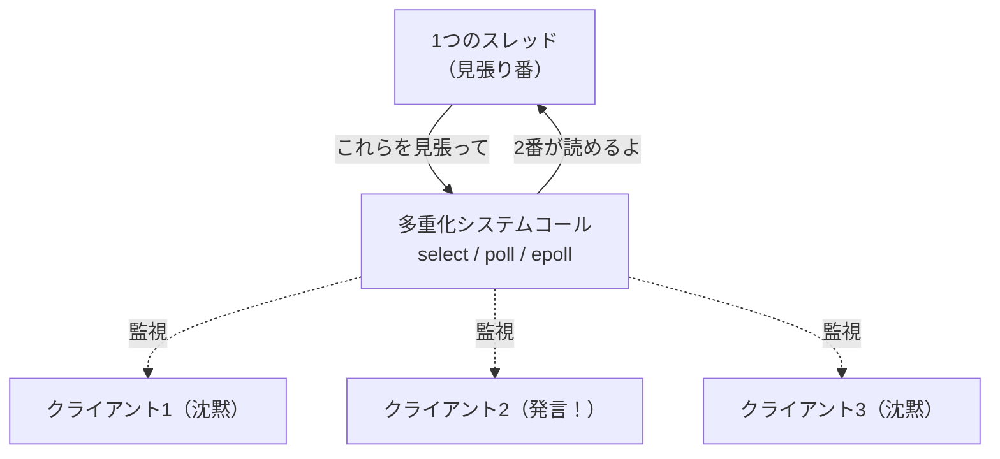

# ブロッキングと I/O 多重化

第1章で「I/O は遅い」「待っている間 CPU は暇だ」という話をしました。本章では、その「待ち」の正体である **ブロッキング** を正面から扱い、たくさんの I/O 相手を一人で同時にさばくための技術――**I/O 多重化（I/O multiplexing）**――を、`select`・`poll`・`epoll` の順に学びます。これは、ネットワークサーバや非同期処理を理解するうえで欠かせない基礎です。

## ブロッキング：待つということ

これまで何気なく使ってきた `gets` や `read` は、実は **ブロッキング（blocking）** な操作です。ブロッキングとは、「処理が完了するまで、その場でプログラムの実行を止めて待つ」という性質を指します。

```ruby
line = gets   # 入力が来るまで、ここでプログラムは止まって待つ
puts "受け取った: #{line}"
```

`gets` を呼んだとき、まだ入力がなければ、この行でプログラムは静止します。利用者がキーを打つまで、次の行は実行されません。このとき OS は、待っているプロセスを **スリープ状態** にして CPU を取り上げ、他の実行可能なプロセスに回します。つまり、待っている間その CPU を無駄遣いしているわけではありません――一つのプログラムから見れば。

問題は、**一つのプログラムで複数の I/O 相手を同時に扱いたい** ときに起きます。

## 一人で大勢を相手にする難しさ

チャットサーバを想像してください。100 人のクライアントが接続していて、誰がいつ発言するか分かりません。素朴に書くと、こうなります。

```ruby
# 素朴だが破綻する書き方
clients.each do |client|
  message = client.gets   # このクライアントの発言を待つ
  broadcast(message)
end
```

このコードは、最初のクライアントの `gets` でブロックしてしまいます。その人が黙っている限り、たとえ他の 99 人が発言していても、プログラムはずっと最初の人を待ち続けます。ブロッキング I/O を順番に並べるだけでは、複数の相手を公平に扱えないのです。

歴史的に、この問題には二つの素朴な解法がありました。

- **プロセスを分ける** — クライアントごとに別プロセスを立てる（`fork`）。確実だが、1 万接続なら 1 万プロセスでメモリを食いつぶす。
- **スレッドを分ける** — クライアントごとにスレッドを立てる。プロセスより軽いが、それでも数が増えると切り替えコストとメモリがかさむ。

これらが「接続数が増えるとスケールしない」という問題に行き着いた歴史的経緯は、Dan Kegel が有名な [C10K 問題](#cite:kegel2006) として整理しました。C10K とは「1 台のサーバで 1 万（10K）の同時接続をどうさばくか」という問いで、2000 年前後のインターネットの成長とともに切実な課題になりました。

> [!NOTE]
> C10K の "C" は Concurrent（同時の）です。1 万接続あっても、本当に同時に通信しているのはごく一部で、大半は「つながっているが沈黙している」状態です。だからこそ「沈黙している相手のためにスレッドを 1 本ずつ占有するのは無駄」という発想が生まれます。

## I/O 多重化という発想

C10K への鍵は、**ノンブロッキング I/O** と **I/O 多重化** の組み合わせです。発想を転換します。「一つずつ待つ」のではなく、**「たくさんの相手をまとめて OS に見張ってもらい、準備ができた相手だけを教えてもらう」** のです。

まず **ノンブロッキング（non-blocking）** にするとは、fd を「準備ができていなければ待たずにすぐ戻る」モードに設定することです。準備ができていない `read` は、待たずに `EAGAIN`（いますぐは無理）というエラーで即座に戻ります。これで「待たされる」ことはなくなりますが、では「いつ準備ができたか」をどう知ればよいのでしょう。総当たりで何度も試す（ビジーループ）のは CPU の無駄遣いです。

そこで登場するのが **I/O 多重化のシステムコール** です。これは「これらの fd のうち、どれかが読み書き可能になるまで私を眠らせ、可能になったら起こして、どれが準備できたかを教えてくれ」とカーネルに頼む仕組みです。一人の見張り番が、たくさんの窓口を同時に監視するイメージです。



これにより、1 本のスレッドで何千もの接続を見張れます。スレッドを接続ごとに立てる必要がなくなり、C10K の壁を越える道が開けるのです。

## select：最初の多重化

最も古くからある多重化のシステムコールが `select` です。基本的な使い方は「監視したい fd の集合を渡し、どれかが準備できるまで待つ」というものです。Ruby では `IO.select` として使えます。

```ruby
# 複数のソケットを同時に見張る
readable, _writable, _error = IO.select(sockets, nil, nil)
readable.each do |sock|
  data = sock.read_nonblock(1024)   # 準備済みなので待たずに読める
  handle(data)
end
```

`IO.select` は、引数に渡したソケットのうち「読める状態になったもの」だけを配列で返します。これで、沈黙している相手を待たずに、発言した相手だけを処理できます。

しかし `select` には構造的な弱点があります。**監視できる fd 数に上限がある**（多くの実装で 1024）こと、そして **毎回すべての fd 集合を渡し直し、カーネルが毎回全部を走査する** ことです。後者は、監視対象が N 個あると 1 回の呼び出しが O(N) のコストになることを意味します。1 万接続では、たとえ 1 つしか準備できていなくても、毎回 1 万個を調べることになり、接続数に比例して重くなります。

## poll：上限は外れたが、走査は残る

`poll` は `select` の改良版で、fd 数の固定上限（1024 の壁）を取り払いました。fd を集合（ビットマップ）ではなく配列で渡す設計になり、より多くの fd を扱えます。

しかし `poll` も、本質的な問題――**毎回すべての監視対象をカーネルへ渡し、カーネルが毎回全部を走査する**――は `select` と同じく抱えたままです。つまり O(N) の重さは残ります。少数の fd を時々見張るには十分ですが、数万の接続を高頻度でさばくには、まだ力不足でした。

> [!NOTE]
> `select`/`poll` の弱点は「状態を毎回ゼロから伝え直す」点にあります。1 万接続のうち変化したのが 1 つだけでも、毎回 1 万個分の情報をユーザ空間とカーネルの間でやりとりし、走査します。この「変化していないものまで毎回相手にする無駄」が、次の `epoll` で解消されます。

## epoll：状態を覚えてもらう

Linux はこの問題に対し、`epoll` という仕組みで答えを出しました（BSD 系には類似の `kqueue` があります）。発想の転換は「**監視対象をカーネルに一度登録しておき、状態を覚えてもらう**」ことです。

`epoll` の使い方は三段階に分かれます。

1. `epoll_create` — 監視用のインスタンス（これ自体も fd）を作る。
2. `epoll_ctl` — 監視したい fd を一度だけ登録する（追加・変更・削除）。
3. `epoll_wait` — 準備ができた fd「だけ」を受け取る。

肝は、毎回すべてを渡し直さないことです。登録はあらかじめ済ませてあり、`epoll_wait` は「いま準備ができているものだけ」を返します。このため、計算量は監視対象の総数 N ではなく、**実際にイベントが起きた数だけ** に比例します。1 万接続のうち 3 つだけがアクティブなら、返ってくるのも 3 つだけ。これにより、接続数が増えても性能がほとんど落ちない、スケーラブルな多重化が実現しました。

この「カーネルに状態を明示的に登録し、変化分だけを受け取る」という設計思想の有効性は、`epoll` 登場以前から研究で示されていました。Banga・Mogul・Druschel による [スケーラブルなイベント通知機構の研究](#cite:banga1999) や、現実的な負荷の下でのサーバ性能を論じた [先行研究](#cite:banga1998) は、まさにこの方向の理論的な裏づけを与えています。`epoll` はその実用化と言えます。

| 機構 | fd 数の上限 | 1 回あたりの計算量 | 状態の保持 |
|------|-----------|------------------|-----------|
| `select` | あり（約1024） | O(N) | しない（毎回渡す） |
| `poll` | なし | O(N) | しない（毎回渡す） |
| `epoll` | なし | O(発生イベント数) | する（登録制） |

## レベルトリガとエッジトリガ

`epoll` には通知の仕方が二種類あり、これは初心者がつまずきやすい重要ポイントなので触れておきます。

- **レベルトリガ（level-triggered, LT）** — 「いま読めるデータがある」状態が続く限り、毎回知らせてくれる。`select`/`poll` と同じ感覚で、扱いやすい。
- **エッジトリガ（edge-triggered, ET）** — 「読めるようになった瞬間（変化）」だけを一度知らせる。一度の通知で、読めるデータをすべて読み切らないと、残りの通知を取り逃す。

エッジトリガは通知回数を減らせて効率的ですが、「通知が来たら、`EAGAIN` が返るまで読み切る」という規律を守らないとデータを取りこぼします。扱いが難しいぶん、高性能サーバで真価を発揮します。両者の正確な意味論は [The Linux Programming Interface](#cite:kerrisk2010) の `epoll` の章に詳しく解説されています。

> [!CAUTION]
> エッジトリガで「通知が一度来たから一回だけ `read` した」というコードは、バッファに残ったデータを次の通知が来るまで処理できず、接続が固まったように見える不具合を生みます。エッジトリガを使うなら、必ずノンブロッキングモードで `EAGAIN` まで読み切るループにしてください。

## 言語処理系にとっての意味

ここまで `select`/`poll`/`epoll` を見てきましたが、ふつうのプログラマがこれらを直接さわることはあまりありません。なぜなら、**言語処理系やそのライブラリが、これらを内部で使ってくれる** からです。

言語処理系の役割は、この OS ごとにバラバラな多重化機構（Linux は `epoll`、BSD/macOS は `kqueue`、Windows は別方式）の違いを吸収し、「たくさんの接続を効率よくさばく」という能力を、簡単なインタフェースで提供することです。次章で見る非同期 I/O や、第8章で扱う Ruby の Fiber スケジューラは、まさにこの多重化機構を土台にして組み立てられています。利用者が `gets` や `read` を素朴に書くだけで、その裏で `epoll` が何千もの接続を見張っている――それが、よくできた処理系の姿です。

## まとめ

- `gets` や `read` は既定で **ブロッキング**で、複数の相手を順に待つと破綻する。
- クライアントごとにプロセス/スレッドを立てる素朴な解法は、接続数が増えると **C10K 問題** に突き当たる。
- 解決の鍵は **ノンブロッキング I/O + I/O 多重化**。一人の見張り番が大勢を監視する。
- `select`（上限あり・O(N)）→ `poll`（上限なし・O(N)）→ `epoll`（登録制・O(イベント数)）と進化した。
- `epoll` には **レベルトリガ / エッジトリガ** があり、後者は強力だが読み切る規律が要る。
- 処理系がこれらの OS 差を吸収し、簡単な I/O インタフェースとして提供する。

`epoll` は「準備ができたか」を効率よく教えてくれますが、データのコピー自体はやはりアプリケーションが `read`/`write` で行います。次章では、その一歩先――「読み書きそのものをカーネルに任せる」非同期 I/O と `io_uring` へ進みます。
