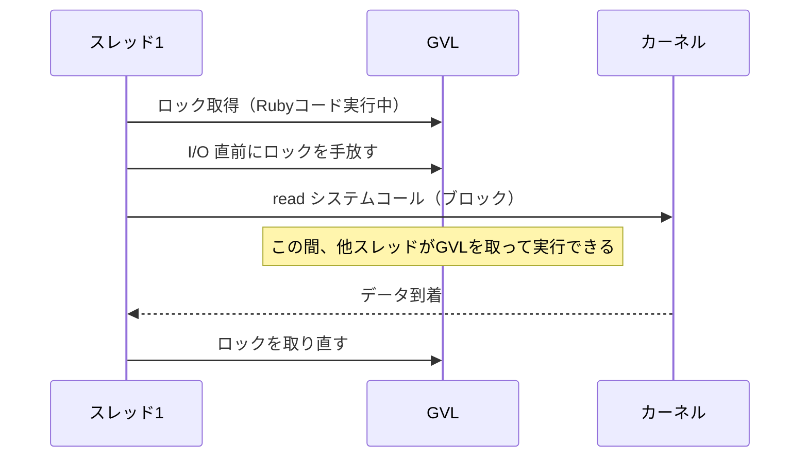
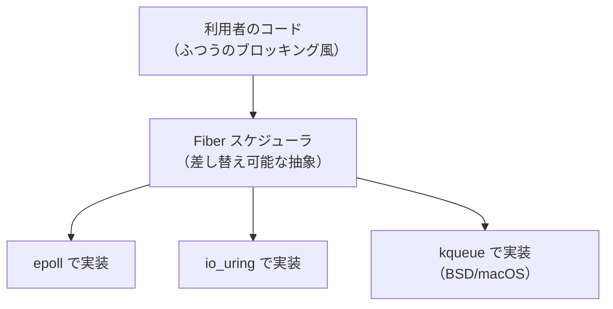

# 言語処理系での実装：Ruby を題材に

ここまでの章で、I/O を支える部品――システムコール、ファイルディスクリプタ、バッファリング、多重化、非同期化――を一つずつ見てきました。本章では視点を実装側に移し、これらの部品が **実際の言語処理系の中でどう組み合わさっているか** を、Ruby を題材に通して眺めます。Ruby は I/O の抽象化が洗練されており、しかも近年 io_uring まで視野に入れた進化を遂げているため、本書の総まとめにふさわしい題材です。

## IO オブジェクト：fd を包む薄い皮

Ruby のすべての入出力は、`IO` クラス（とその子孫 `File` など）に集約されています。第3章で学んだことを思い出すと、`IO` オブジェクトの正体が見えてきます。それは、**ファイルディスクリプタ（小さな整数）を包み、その上にバッファとエンコーディング変換を載せたもの** です。

```ruby
io = File.open("data.txt")
io.fileno     # => 中に抱えている fd（例: 7）
io.read       # バッファ経由で読む（高水準）
io.sysread(4) # fd へ直接 read システムコール（低水準）
```

つまり Ruby の `IO` は、第2章〜第4章で論じた「ストリームという抽象」「バッファリング」「バイト⇔文字の変換」を、一つのオブジェクトに束ねた存在です。利用者は fd の番号もシステムコールも意識せず、`read`/`write`/`puts`/`gets` という統一語彙だけで、ファイルも端末もソケットも扱えます。第3章で「fd は何を指すかを隠す」と述べましたが、`IO` オブジェクトはその隠蔽を言語レベルでさらに一段おし進めたものなのです。

## GVL：ブロッキング I/O とスレッドの両立

ここで、多くの言語処理系が直面する難問に触れます。Ruby（CRuby）には **GVL（Giant VM Lock、グローバル VM ロック。GIL とも呼ばれる）** という仕組みがあります。これは「**一度に Ruby のコードを実行できるスレッドは 1 本だけ**」という制約をかけるロックです。処理系の内部実装を単純で安全に保つための、現実的な設計判断です。

素朴に考えると、これは困った性質に思えます。第6章のチャットサーバのように複数スレッドで複数の接続を扱いたいのに、1 本しか動けないなら、一つのスレッドが `gets` でブロックした瞬間、他の全スレッドも巻き添えで止まってしまうのでは――?

ここに、I/O とスレッドをめぐる処理系実装の妙があります。CRuby は、**ブロッキングする I/O システムコールを呼ぶ直前に GVL を手放し、システムコールから戻った後に GVL を取り直す** という設計になっています。



つまり「1 本しか Ruby コードを実行できない」けれども、「**I/O で待っている間はロックを手放す**」ので、あるスレッドが `read` で寝ている間、他のスレッドは Ruby コードを進められます。CPU を使う計算は並列化できなくても、I/O 待ちは重ね合わせられる――これが、GVL を持つ処理系でもスレッドが I/O 並行性に役立つ理由です。CRuby ではこの「GVL を手放してブロッキング操作を行う」ための内部機構が用意されており、I/O 系のメソッドはこれを使って実装されています。

> [!NOTE]
> GVL は Ruby 特有のものではありません。CPython にも GIL という同種の仕組みがあり、やはり I/O 待ちの間はロックを手放します。「処理系の実装を単純に保ちつつ、I/O 並行性だけは確保する」という落としどころは、スクリプト言語の処理系で広く採られてきた現実解です。

## ノンブロッキング I/O のための道具立て

第6章で学んだノンブロッキング I/O と多重化を、Ruby は標準で利用者に開放しています。`IO#read_nonblock`／`IO#write_nonblock` と `IO.select` です。

```ruby
require "socket"
server = TCPServer.new(0)
clients = []

loop do
  # server も含め、読める状態になった fd を多重化で待つ
  readable, = IO.select([server, *clients])
  readable.each do |io|
    if io == server
      clients << server.accept        # 新規接続を受け付ける
    else
      begin
        data = io.read_nonblock(1024) # 待たずに読む
        handle(io, data)
      rescue IO::WaitReadable
        next                          # まだ読めない（EAGAIN 相当）
      rescue EOFError
        clients.delete(io); io.close  # 切断された
      end
    end
  end
end
```

注目すべきは、第6章で見た OS レベルの概念がそのまま顔を出している点です。`IO.select` は多重化システムコール（内部では環境に応じて `select`/`poll` などを使う）への入口であり、`IO::WaitReadable` は `EAGAIN`（いますぐ読めない）を Ruby の例外に翻訳したものです。第3章で「処理系は `errno` を例外へ翻訳する」と述べた、その実例がここにあります。

ただし、このコードは見てのとおり煩雑です。状態を自分で管理し、例外を細かく捌かねばならず、第6章で論じた「素朴に書くと破綻する」問題の裏返しとして「正しく書くと複雑になる」という代償を払っています。この複雑さをどう隠すか――それが次の話題です。

## Fiber スケジューラ：複雑さを処理系に押し戻す

Ruby 3.0（2020 年）で導入された **Fiber スケジューラ（Fiber Scheduler）** は、まさにこの「ノンブロッキング I/O の複雑さを、利用者から処理系の側へ押し戻す」ための仕組みです。提案者は Ruby コア開発者の Samuel Williams で、その設計は [Ruby の Feature #16786](#cite:ruby16786) で議論されました。

鍵となる部品が **Fiber（ファイバ）** です。Fiber は「途中で実行を中断し、後で再開できる軽量な処理の単位」で、OS スレッドよりずっと安価です。アイデアはこうです。

1. プログラムはふつうに `gets` や `read` を **ブロッキングするように書く**。
2. しかし実行は Fiber の上で行う。
3. I/O がブロックしそうになると、処理系はそっと **その Fiber を中断し、別の実行可能な Fiber に切り替える**。
4. 中断中の I/O は、裏で多重化機構（`epoll` など）が見張る。
5. I/O の準備ができたら、中断していた Fiber を再開する。

```ruby
require "async"   # Fiber スケジューラを実装した代表的な gem

Async do
  # 見た目はふつうのブロッキングなコード。だが内部は非同期
  Async { puts URI.open("https://example.com/a").read }
  Async { puts URI.open("https://example.com/b").read }
  # 2 つの取得は、待ち時間が自動的に重ね合わされる
end
```

利用者から見れば、上から下へ素直に流れる、ブロッキング風の読みやすいコードです。しかし内部では、ある取得が応答を待っている間に別の取得が進み、待ち時間が自動的に多重化されます。第6章のあの煩雑な `IO.select` ループが、丸ごと処理系（とスケジューラ gem）の内側へ消えたのです。

これこそ、本書が繰り返し述べてきた「**性能のための複雑さを処理系の内側に隠し、利用者には単純な見た目を残す**」という抽象化の、最も洗練された到達点の一つと言えます。Fiber スケジューラを使った実アプリケーションの構築については、作者自身による [RubyKaigi 2022 の発表](#cite:williams2022) が具体的で参考になります。

## io_uring まで届く：処理系の最前線

ここで第7章の io_uring が戻ってきます。Fiber スケジューラの巧みな点は、I/O 待ちを「どの OS 機構で実現するか」を **差し替え可能なインタフェース** として切り出したことです。スケジューラの裏側は、`epoll` で実装してもよいし、`io_uring` で実装してもよい。利用者のコードは一切変えずに、土台だけをより高速な機構へ載せ替えられます。

実際、Ruby の I/O 抽象を io_uring と橋渡しするために、低レベルなバッファを直接扱う `IO::Buffer` クラスが導入されるなど、処理系の内部は io_uring を活かせるよう着実に整えられてきました。第7章で「利用者は io_uring を直接は使わず、処理系が吸収する」と述べた、その吸収がまさにここで起きています。



この構図は、本書全体の縮図です。いちばん上に利用者の素朴なコードがあり、いちばん下に OS ごとの I/O 機構（`epoll`/`io_uring`/`kqueue`）があり、その間を処理系が橋渡しする。第1章で描いた「積み重なる層」の絵が、最終章でこうして具体的な実装として立ち上がってきました。

> [!IMPORTANT]
> ここで強調したいのは、これらは「未来の夢」ではなく、いま動いている現実の処理系の姿だということです。あなたが `puts` や `gets` を書くたびに、その下では本書で学んだすべて――システムコール、ファイルディスクリプタ、バッファリング、多重化、そして場合によっては io_uring――が静かに働いています。処理系を学ぶとは、この「静かに働く下層」を見えるようにすることなのです。

## 自作言語への示唆

最後に、これから自分の言語処理系を作る人へ、本書からの実践的な示唆をまとめます。

- **まず統一された `IO` 抽象を設計する。** fd やハンドルを直接見せず、`read`/`write` の少数の語彙にまとめる（第2・3章）。
- **バッファリングを最初から組み込む。** 利用者に意識させず、`flush` の手段だけは用意する（第4章）。
- **OS 依存を一箇所に閉じ込める。** 多重化や非同期化は OS ごとに違うので、差し替え可能なインタフェースにしておく（第5・6章）。
- **エラーは OS の `errno` ではなく、言語にとって自然な例外へ翻訳する**（第3章）。
- **並行性は後から足せる構造にしておく。** Fiber/コルーチンのような中断・再開の仕組みがあると、ブロッキング風 API のまま非同期化できる（本章）。

これらはどれも、本書で一つずつ積み上げてきた考え方の応用にすぎません。

## まとめ

- Ruby の `IO` は、**fd を包み、バッファとエンコーディング変換を載せた** オブジェクトで、本書の前半の概念を一つに束ねている。
- **GVL** があっても、I/O 待ちの間にロックを手放すことで、スレッドは I/O 並行性に役立つ。
- ノンブロッキング I/O（`read_nonblock` + `IO.select`）は強力だが煩雑で、その複雑さを **Fiber スケジューラ** が処理系の側へ押し戻した。
- Fiber スケジューラは I/O 機構を差し替え可能にし、**`epoll` から io_uring まで** を利用者のコードを変えずに載せ替えられる。
- これらは、本書を貫く「複雑さを処理系の内側に隠す」という抽象化の、現実の到達点である。

`puts "Hello, World!"` の一行から始まった旅は、io_uring と Fiber スケジューラまでたどり着きました。あなたがこれから読むコードや作る処理系の中で、本書の地図が役立つことを願っています。
