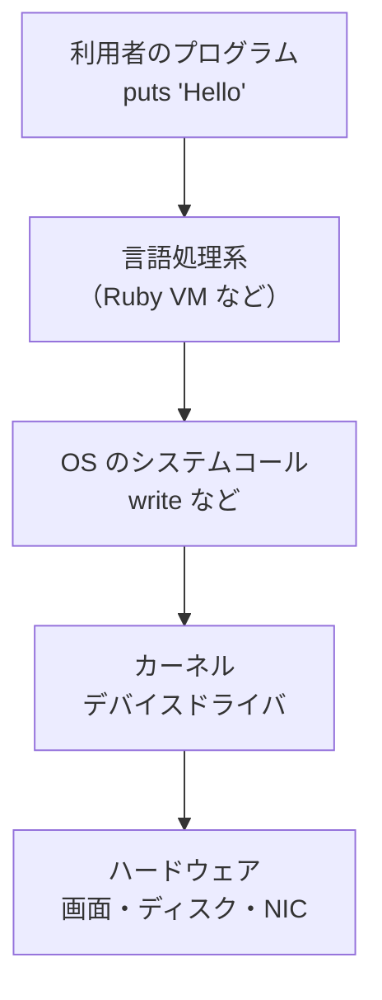

# はじめに：言語処理系と I/O

プログラミングを学ぶと、ほぼ最初に書くのが「Hello, World!」です。Ruby なら次の一行です。

```ruby
puts "Hello, World!"
```

このプログラムは「文字列を画面に表示する」だけのものですが、その「表示する」という動作こそが本書の主役、**I/O（入出力）** です。本章では、そもそも I/O とは何か、なぜそれが **言語処理系（language processing system）** にとって重要なのかを整理し、本書全体の地図を描きます。

## I/O とは何か

**I/O** は Input/Output、すなわち「入力」と「出力」の略です。プログラムは、計算するだけでは役に立ちません。外の世界からデータを受け取り（入力）、計算した結果を外の世界へ届ける（出力）ことで、はじめて意味を持ちます。ここでいう「外の世界」とは、たとえば次のようなものです。

- **キーボードや画面（端末／ターミナル）** — 人間とのやりとり
- **ファイルシステム** — ディスク上のファイルの読み書き
- **ネットワーク** — 他のコンピュータとの通信
- **パイプ** — 別のプログラムとのデータの受け渡し

CPU の内部で完結する足し算や比較と違い、I/O はプログラムの外、しかも多くの場合はずっと遅いデバイスを相手にします。この「遅さ」と「外部性」が、I/O を技術的に面白く、そして難しくしている根本の理由です。

> [!NOTE]
> 本書で「デバイス」と言うときは、ディスクやネットワークカード、キーボードなど、データの出入り口になるハードウェアを指します。CPU から見ると、これらはすべて「遅くて、いつ準備が整うか分からない相手」です。

## 言語処理系とは何か

**言語処理系** とは、プログラミング言語で書かれたソースコードを解釈・実行（あるいは機械語へ変換）するソフトウェアの総称です。大きく二つに分けられます。

- **コンパイラ（compiler）** — ソースコードを別の形式（機械語や中間コード）へ翻訳するプログラム。C 言語の `gcc` などが典型です。
- **インタプリタ（interpreter）** — ソースコードを読みながら、その場で実行していくプログラム。Ruby や Python の処理系がこれにあたります。

実際には両者の中間や組み合わせも多く、たとえば Ruby は、ソースコードをいったん **バイトコード（bytecode）**（処理系が解釈しやすい中間表現）へ変換し、それを **仮想マシン（VM, virtual machine）** が実行します。本書では、こうしたインタプリタやコンパイラのランタイム（実行時システム）をまとめて「言語処理系」と呼びます。

ここで重要なのは、**言語処理系は二つの立場で I/O に関わる** ということです。

1. **処理系自身が行う I/O** — ソースコードのファイルを読み込む、エラーメッセージを表示する、といった、処理系が動くために必要な入出力。
2. **言語が利用者に提供する I/O** — `puts` や `File.open` のように、その言語で書かれたプログラムが使うための入出力機能。

本書が主に注目するのは 2 番目、つまり「言語が `puts` や `gets` のような道具をどう実現しているか」です。これらの道具の裏側には、必ず OS の機能の呼び出しがあります。

## なぜ I/O のために OS を学ぶ必要があるのか

`puts "Hello"` の一行は、最終的には OS への「お願い」へと姿を変えます。なぜなら、画面やディスク、ネットワークといったハードウェアを直接さわる権限を持っているのは OS（より正確にはその中核である **カーネル, kernel**）だけだからです。アプリケーションは、ハードウェアに触りたいとき、必ず OS に仲介を頼みます。この「お願い」の仕組みが、第3章で詳しく扱う **システムコール（system call）** です。

つまり、言語処理系の I/O を理解するということは、次の積み重なった層を理解することにほかなりません。



言語設計者や処理系の実装者は、上から下までのすべての層を意識しなければなりません。たとえば「`puts` を呼ぶたびに OS にお願いすると遅い」という問題は、第4章の **バッファリング** につながりますし、「OS にお願いした後、答えが返るまで待っていると他の仕事ができない」という問題は、第6章・第7章の **ノンブロッキング I/O** や **非同期 I/O** につながります。

OS の動作原理そのものについては、定評のある教科書 [Operating Systems: Three Easy Pieces](#cite:arpaci2018) が無料で読めるので、本書と並行して参照することを勧めます。UNIX 系 OS のシステムプログラミングを体系的に学ぶなら [Advanced Programming in the UNIX Environment](#cite:stevens2013) や [The Linux Programming Interface](#cite:kerrisk2010) が定番です。

## I/O はなぜ「遅い」のか

I/O を考えるうえで避けて通れないのが速度です。CPU の演算は 1 ナノ秒（10 億分の 1 秒）程度のオーダーで進みますが、ディスクやネットワークへのアクセスはその数千倍から数百万倍も遅いことがあります。次の表は、典型的なおおよその時間感覚です（機器によって大きく変動します）。

| 操作 | おおよその所要時間 |
|------|------------------|
| CPU で 1 命令を実行 | 1 ナノ秒未満 |
| メインメモリへのアクセス | 100 ナノ秒程度 |
| SSD への読み書き | 数十マイクロ秒 |
| ネットワーク往復（同一データセンタ内） | 数百マイクロ秒 |
| ハードディスクのシーク | 数ミリ秒 |

注目すべきは「桁」が大きく違うことです。CPU から見ると、ディスクやネットワークの完了を待つのは、人間の感覚でいえば「手紙を出して返事が来るのを何日も待つ」ようなものです。この圧倒的な速度差こそが、本書で扱うバッファリングや非同期化といった工夫が必要になる根本原因です。

> [!TIP]
> 「I/O が遅い」と聞くと避けたくなりますが、見方を変えれば、待っている間 CPU は暇です。その暇な時間を別の仕事に使えれば、システム全体の効率は大きく上がります。この発想が、第6章以降の多重化・非同期化のすべての出発点になります。

## 本書の構成

本書はおおよそ次のように進みます。

- **第2章 言語処理系で求められる I/O** — `print`、`gets`、ファイル、標準入出力、エンコーディングなど、言語が提供すべき I/O 機能を整理します。
- **第3章 OS が提供する I/O の基礎** — システムコール、ファイルディスクリプタ、`read`/`write` といった、すべての土台を学びます。
- **第4章 バッファリングとストリーム** — なぜバッファが必要か、行バッファリングとは何かを、Ruby の挙動とあわせて理解します。
- **第5章 OS ごとの I/O の違い** — Unix と Windows の違い、改行コード、テキスト/バイナリモードなど、移植性の問題を扱います。
- **第6章 ブロッキングと I/O 多重化** — `select`/`poll`/`epoll` と、有名な C10K 問題を学びます。
- **第7章 非同期 I/O と io_uring** — 最新の高性能 I/O インタフェースまで踏み込みます。
- **第8章 言語処理系での実装** — Ruby を題材に、これまでの話が処理系の中でどう組み合わさるかを見ます。
- **付録 A 用語集** — 本書に登場する用語をまとめています。

それでは、まず「言語が提供すべき I/O とは何か」から始めましょう。
