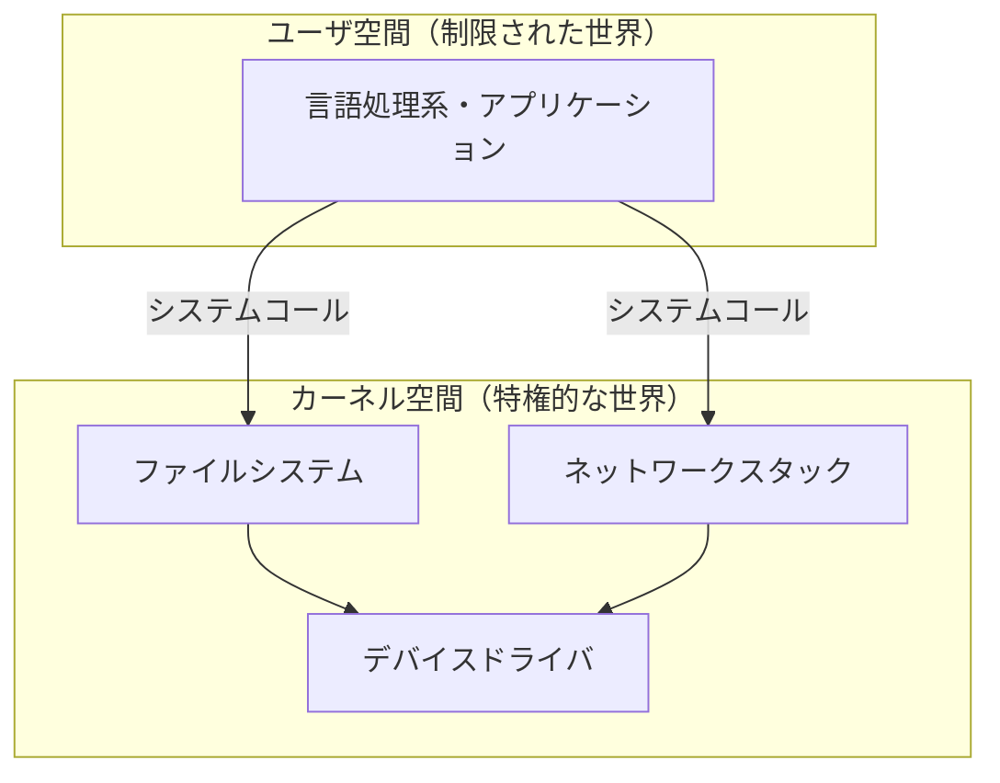

# OS が提供する I/O の基礎

前章で見たとおり、`puts` も `File.read` も、最終的には OS にハードウェア操作をお願いすることで実現されます。本章では、その「お願い」の正体である **システムコール** と、I/O の主役である **ファイルディスクリプタ** を学びます。ここは本書全体の土台なので、少していねいに進みます。

> [!NOTE]
> 本章で扱う **システムコール**、**ファイルディスクリプタ**、`errno` といった概念は、Linux や macOS が準拠する **POSIX**（UNIX 系 OS の標準規格）の I/O モデルに基づきます。本書はこのモデルを土台に説明を進めますが、Windows はネイティブには別の設計（`HANDLE` など）を採用しており、ここで述べる「整数の fd」がそのまま当てはまるわけではありません。OS による違いと、言語処理系がそれをどう吸収するかは [](os-differences.md) で改めて扱います。

## ユーザ空間とカーネル空間

現代の OS は、メモリと CPU の動作を二つの世界に分けています。

- **カーネル空間（kernel space）** — OS の中核（カーネル）が動く、特権的な世界。ハードウェアに直接アクセスできる。
- **ユーザ空間（user space）** — アプリケーション（言語処理系を含む）が動く、制限された世界。ハードウェアには直接さわれない。

なぜ分けるのでしょうか。もしアプリケーションがディスクやメモリを直接好き勝手に操作できたら、バグのあるプログラム一つが他のプログラムや OS 全体を巻き添えにして壊してしまいます。そこで、危険な操作はすべてカーネルに集約し、アプリケーションには「カーネルにお願いする」道だけを残しているのです。この保護の考え方は OS の根幹であり、[Operating Systems: Three Easy Pieces](#cite:arpaci2018) でも繰り返し強調されています。



## システムコールとは何か

**システムコール（system call）** は、ユーザ空間のプログラムがカーネルに仕事を依頼するための、ただ一つの正式な入り口です。関数呼び出しに似ていますが、決定的に違うのは、呼び出した瞬間に CPU が **ユーザモードからカーネルモードへ切り替わる（モード遷移する）** 点です。

I/O に関わる代表的なシステムコールは、驚くほど少数です。

| システムコール | 役割 |
|--------------|------|
| `open` | ファイルなどを開き、ファイルディスクリプタを得る |
| `read` | ファイルディスクリプタからバイト列を読む |
| `write` | ファイルディスクリプタへバイト列を書く |
| `close` | ファイルディスクリプタを閉じて資源を返す |
| `lseek` | 読み書き位置を移動する |

たったこれだけの操作で、ファイルも端末もネットワークも扱えてしまうところに、UNIX の設計の美しさがあります。これらのシステムコールの正確な仕様は、Linux なら `man 2 read` のようにマニュアルの第2章で読めますし、[The Linux Programming Interface](#cite:kerrisk2010) に網羅的な解説があります。

> [!NOTE]
> 「システムコールは関数呼び出しより重い」とよく言われます。モード遷移のためにレジスタの退避やセキュリティチェックが必要で、ふつうの関数呼び出しの何十倍もの時間がかかることがあります。この「システムコールのコスト」が、第4章のバッファリングを必要とする大きな理由です。

## ファイルディスクリプタ：すべてをつなぐ整数

ここで本章の主役、**ファイルディスクリプタ（file descriptor、しばしば fd と略す）** を紹介します。これは POSIX 系 OS において、開いている I/O 対象を指し示す **小さな非負整数** にすぎません。`open` を呼ぶとカーネルがこの整数を一つ割り当てて返し、以降の `read`/`write`/`close` ではこの整数で対象を指定します。

前章で触れた標準ストリームは、実はこの fd の固定番号として表されています。

| ファイルディスクリプタ | 対応 |
|---------------------|------|
| `0` | 標準入力（stdin） |
| `1` | 標準出力（stdout） |
| `2` | 標準エラー出力（stderr） |

つまり `puts "Hi"` は、突き詰めれば「fd `1` に `Hi\n` というバイト列を `write` する」という操作です。Ruby から fd を直接のぞくこともできます。

```ruby
$stdout.fileno   # => 1
$stderr.fileno   # => 2
File.open("data.txt") { |f| f.fileno }  # => 3 など（その時空いている番号）
```

ファイルディスクリプタの賢いところは、**何を指しているかを利用者から隠してくれる** 点です。fd `5` がディスク上のファイルなのか、ネットワーク接続なのか、別プロセスへのパイプなのかは、`read`/`write` する側からは区別する必要がありません。これが、前章で述べた「すべてはストリーム」という統一抽象を、OS の側で支えている仕組みです。

> [!IMPORTANT]
> ファイルディスクリプタは **有限の資源** です。一つのプロセスが同時に開ける fd の数には上限があります（`ulimit -n` で確認・変更できます）。前章で「ファイルは閉じよう」と強調したのは、この上限のためです。`close` を忘れて fd を使い切ると、新たにファイルを開いたりネットワーク接続を張ったりできなくなり、`Too many open files`（`EMFILE`）というエラーになります。

## read と write の素朴な姿

言語処理系の上品なメソッドの下では、最終的に `read`/`write` が呼ばれます。これらの「生の」振る舞いを理解しておくと、上位の挙動が腑に落ちます。Ruby には、システムコールにほぼ直結した `IO#sysread` / `IO#syswrite` が用意されています。

```ruby
File.open("data.txt") do |f|
  bytes = f.sysread(4)   # write/read の生バージョン。最大 4 バイト読む
  p bytes                # 読めたぶんだけ返る（4 バイトとは限らない）
end
```

ここで初心者がよく誤解するのが、**`read` は要求したバイト数より少なく返すことがある** という事実です。たとえば「100 バイト読んで」と頼んでも、まだ 30 バイトしか届いていなければ 30 バイトだけ返ってくることがあります（特にネットワークやパイプで顕著です）。同様に `write` も、頼んだ全部を一度に書けず、書けたバイト数だけを返すことがあります。これを **部分読み込み・部分書き込み（partial read / write）** と呼びます。

このため、確実に N バイトを読み書きするには、ループで残りを処理し続ける必要があります。

```ruby
def write_all(io, data)
  remaining = data.b           # バイト列として扱う
  until remaining.empty?
    n = io.syswrite(remaining) # 書けたバイト数が返る
    remaining = remaining.byteslice(n..)  # 書けた分を捨て、残りを次へ
  end
end
```

幸い、私たちがふだん使う `puts` や `IO#write` は、こうしたループを内部で面倒見てくれます。しかし、処理系の側はこの泥臭い処理を必ずどこかで引き受けているのです。部分読み書きの正確な意味論は [The Linux Programming Interface](#cite:kerrisk2010) や [Linux System Programming](#cite:love2013) で確認できます。

## エラーは戻り値で伝わる：errno

システムコールはどうやって失敗を伝えるのでしょうか。UNIX 系では伝統的に、**戻り値で成否を示し、失敗の詳細は `errno` という大域変数に番号で入る**、という方式をとります。たとえば存在しないファイルを開けば `ENOENT`（No such file or directory）、権限がなければ `EACCES`（Permission denied）が `errno` に設定されます。

言語処理系の役割の一つは、この素っ気ない番号を **意味のある例外（exception）** に翻訳することです。Ruby では `errno` の各値が `Errno::ENOENT` のような例外クラスへと対応づけられています。

```ruby
begin
  File.open("/no/such/file")
rescue Errno::ENOENT => e
  warn "ファイルが見つかりません: #{e.message}"
end
```

利用者は番号を覚える必要がなく、わかりやすい名前の例外を `rescue` できます。これは「OS の生の作法を、言語にとって自然な形へ翻訳する」という、処理系の典型的な仕事です。後の章で繰り返し登場する `EAGAIN`／`EWOULDBLOCK`（いますぐには処理できない）も、この `errno` の一員です。

## まとめ

本章では、I/O のいちばん下の土台を学びました。

- OS はユーザ空間とカーネル空間を分けて保護しており、その境界を越える唯一の入り口が **システムコール** である。
- I/O の中心は `open`/`read`/`write`/`close` というごく少数のシステムコールで、開いた対象は **ファイルディスクリプタ**（小さな整数）で指す。
- 標準入出力は fd `0`/`1`/`2` に対応し、fd は有限資源なので必ず `close` する。
- `read`/`write` は要求より少ないバイトしか処理しないことがあり（部分読み書き）、処理系はそれをループで吸収する。
- 失敗は `errno` で伝わり、処理系がそれを例外へ翻訳する。

ここで気づくのは、`read`/`write` を「呼ぶたびに」システムコールが走るのはコストが高い、という問題です。次章では、その対策である **バッファリング** を学びます。
